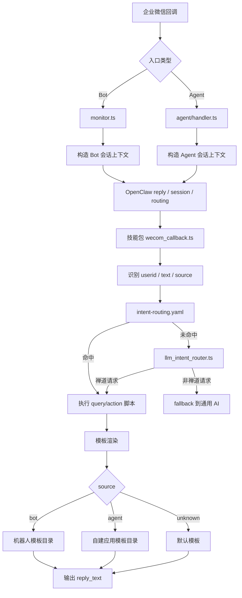

# 企微到禅道的当前运行时链路
更新时间：2026-04-08

本文从运行时视角说明当前消息如何从企业微信进入 OpenClaw，再落到禅道查询/操作脚本，并最终回复给用户。

## 1. 全链路概览



## 2. Bot 运行时链路

入口文件：

- `openclaw-server-config/extensions/wecom/src/monitor.ts`

处理过程：

1. 接收企业微信机器人回调
2. 校验签名、解析 JSON
3. 做消息去重和 debounce 聚合
4. 构造 OpenClaw inbound context
5. 将消息交给 OpenClaw 会话与回复调度系统
6. 如命中禅道能力，进入 `openclaw-zentao-pack`
7. 最终优先通过 Bot 原会话回复

Bot 路径的重要特征：

- 可能是群聊，也可能是单聊
- 上游常带 `response_url`
- 流式输出、占位回复、结束收口都依赖 Bot 流
- 遇到文件、超时、权限或群发限制时，可能切到 Agent 私信兜底

## 3. Agent 运行时链路

入口文件：

- `openclaw-server-config/extensions/wecom/src/agent/handler.ts`

处理过程：

1. 接收企业微信自建应用回调
2. 校验签名、解密 XML
3. 转成统一消息对象
4. 构造 OpenClaw inbound context
5. 将回复目标锁定为 `wecom-agent:${fromUser}`
6. 进入 OpenClaw 会话与技能分发
7. 最终通过 Agent API 私信回复触发者

Agent 路径的重要特征：

- 默认面向触发者私信交付
- 不依赖 Bot `response_url`
- 通过 `wecom-agent:` 前缀避免与 Bot 出站链路混用

## 4. 技能包内的统一编排链路

统一入口：

- `openclaw-zentao-pack/scripts/callbacks/wecom_callback.ts`

统一抽取能力：

- `userid`
- `text`
- `message_source`
- `attachment`

统一处理顺序：

1. 通讯录同步回调优先处理
2. 附件导入任务特殊分支优先处理
3. 读取 `intent-routing.yaml` 匹配稳定意图
4. 未命中时调用 `llm_intent_router.ts`
5. 执行目标脚本
6. 使用模板生成 `reply_text`
7. 输出结构化 JSON

## 5. 来源识别当前怎么做

来源识别文件：

- `openclaw-zentao-pack/scripts/shared/wecom_payload.ts`

识别方法：

- `detectWecomMessageSource(payload)`

判定规则：

- Bot 载荷特征：
  - `msgtype`
  - `userid` / `userId`
  - `response_url`
  - `sender.userid`
- Agent 载荷特征：
  - `MsgType`
  - `FromUserName`
  - `ToUserName`
  - `AgentID`

输出值：

- `bot`
- `agent`
- `unknown`

## 6. 模板渲染链路

相关文件：

- `scripts/callbacks/wecom_reply_formatter.ts`
- `scripts/replies/template_registry.ts`
- `scripts/replies/agent_template_registry.ts`
- `scripts/replies/templates/`
- `scripts/replies/agent_templates/`

当前模板选择规则：

`buildScriptResultReply` 会先看 `message_source`：

- `agent`：走 `agent_template_registry.ts`
- `bot`：走原 `template_registry.ts`
- `unknown`：回退默认模板

这样做的目标很明确：

- 机器人回复模板保持原样
- 自建应用回复模板可以独立演进
- 路由配置仍继续写原来的 `reply_template: xxx`

## 7. 当前已经明确的回复分工

### 7.1 Bot 会话

适合：

- 群聊即时反馈
- 原会话连续追问
- 流式占位与“处理中”提示

限制：

- 某些内容不适合或无法直接在群内交付
- 存在会话权限、文件发送、时窗等约束

### 7.2 Agent 会话

适合：

- 私信持续交互
- 命令回执
- Bot 不便承载的文件或兜底内容
- 自建应用卡片类回复

限制：

- 天然不是群内原地回复
- 用户感知上更像“应用私信”而不是“机器人群消息”

## 8. Agent 卡片回复的新增链路

自建应用与机器人目前还有一个关键差异：

- 机器人原链路本来就有卡片相关处理
- 自建应用链路原先只有文本和媒体发送
- 现在自建应用也已支持 `template_card`

新增出口逻辑位于：

- `openclaw-server-config/extensions/wecom/src/agent/handler.ts`
- `openclaw-server-config/extensions/wecom/src/agent/api-client.ts`

新增行为如下：

1. 如果 Agent 最终回复文本看起来是 JSON
2. 且 JSON 顶层包含 `template_card`
3. 则不再按普通文本发送
4. 而是调用 `sendTemplateCard(...)`
5. 使用企业微信自建应用接口发送卡片

这意味着：

- `agent_templates` 可以返回卡片 JSON
- 机器人模板仍保持原样
- 同一个意图现在可以做到 Bot 回复文本、Agent 回复卡片

## 9. 当前 `query-my-tasks` 的实际分流状态

`query-my-tasks` 已经是当前分流样板：

- Bot 侧继续使用原来的文本模板
- Agent 侧改为单独模板
- Agent 模板当前输出 `text_notice` 卡片 JSON

相关文件：

- `scripts/replies/templates/query-my-tasks.ts`
- `scripts/replies/agent_templates/query-my-tasks.ts`
- `scripts/replies/agent_template_registry.ts`

因此当前运行时效果是：

- 从企微机器人进来的“我的任务”请求，走原文字回复
- 从企微自建应用进来的“我的任务”请求，走卡片回复逻辑

## 10. 当前真实测试结论

2026-04-08 已使用 `openclaw-zentao-pack/config.json` 做过真实卡片发送测试。

测试对象：

- `xianmin`
- `lengleng`

测试结果：

- `gettoken` 成功
- `message/send` 已发起
- 两个用户都返回 `errcode=60020`
- 错误含义是：当前出口 IP 不在企业微信可信 IP 白名单

所以现在的结论要分成两层理解：

- 代码层：自建应用卡片回复链路已经打通
- 环境层：当前机器还不具备对外成功投递企微卡片的网络条件

## 11. 后续验证方式

建议后续统一用下面两种方式验证：

### 11.1 本地直连验证

```bash
npm run test-wecom-agent-card -- ./config.json xianmin
```

适合验证：

- 企业微信凭据是否有效
- 当前出口 IP 是否已放通
- 目标用户是否能收到卡片

### 11.2 真实消息链路验证

验证步骤：

1. 在企微自建应用里给 OpenClaw 发“我的任务”
2. 观察 `agent/handler.ts` 是否识别为 Agent 来源
3. 观察 `wecom_callback.ts` 是否识别出 `message_source=agent`
4. 观察 `buildScriptResultReply` 是否命中 `agent_template_registry`
5. 确认最终回复内容为 `{"template_card": ...}`
6. 由 Agent handler 将该 JSON 发成企微卡片

只要这 6 步都成立，说明自建应用分流和卡片回复都已经走在正确路径上。
