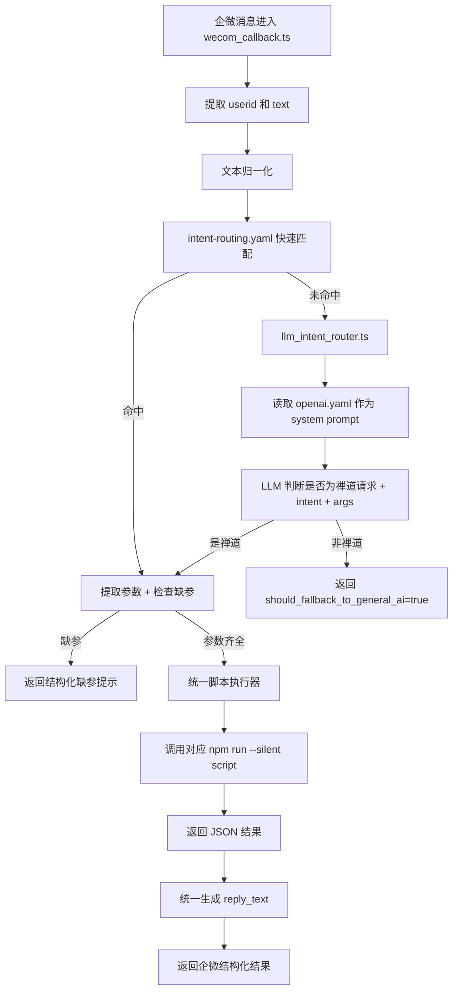

# 企微禅道最新实现流程说明

更新时间：2026-04-03

## 1. 当前整体链路

当前服务器 `1.14.73.166` 上，企业微信消息进入禅道技能后的处理流程已经升级为：

1. 企业微信消息进入回调入口
2. 提取 `userid` 和消息文本
3. 先做一层文本归一化
4. 使用 `intent-routing.yaml` 做高优先级快速路由
5. YAML 命中后，走统一脚本执行器
6. YAML 未命中时，进入 LLM 禅道意图判定
7. 如果 LLM 判断为禅道请求，继续走统一脚本执行器
8. 如果 LLM 判断为非禅道请求，返回 `should_fallback_to_general_ai: true`

一句话概括：

`文本归一化 -> YAML 快路由 -> LLM 禅道兜底 -> 统一脚本执行 -> 非禅道转普通 AI`

## 1.1 流程图



## 2. 当前关键文件

### 2.1 总入口

- 回调入口：
  [wecom_callback.ts](/root/.openclaw/workspace/skills/openclaw-zentao-pack/scripts/callbacks/wecom_callback.ts)

职责：

- 解析企微回调 payload
- 提取 `userid`
- 提取消息文本
- 执行文本归一化
- 优先走 YAML 快路由
- YAML 未命中时调用 LLM 禅道判定
- 统一返回结构化结果

### 2.2 路由真源

- 路由配置：
  [intent-routing.yaml](/root/.openclaw/workspace/skills/openclaw-zentao-pack/agents/modules/intent-routing.yaml)

职责：

- 定义稳定意图
- 定义触发词 `triggers`
- 定义执行脚本 `script`
- 定义 `required_args`
- 定义 `required_args_any`
- 定义默认参数，如 `userid: current_user`

### 2.3 LLM 禅道判定器

- LLM 路由器：
  [llm_intent_router.ts](/root/.openclaw/workspace/skills/openclaw-zentao-pack/scripts/callbacks/llm_intent_router.ts)

职责：

- 在 YAML 未命中时判断“这是不是禅道请求”
- 判断最接近哪个 `intent`
- 抽取 `args`
- 识别 `missing_args`
- 返回 `confidence` 和 `reason`

### 2.4 LLM 提示词真源

- Prompt 文件：
  [openai.yaml](/root/.openclaw/workspace/skills/openclaw-zentao-pack/agents/openai.yaml)

职责：

- 作为 LLM 禅道判定的 system prompt 来源
- 约束输出格式和意图判断规则
- 强调 YAML 优先、LLM 兜底

### 2.5 禅道客户端

- 禅道客户端：
  [zentao_client.ts](/root/.openclaw/workspace/skills/openclaw-zentao-pack/scripts/shared/zentao_client.ts)

职责：

- 使用机器人账号登录禅道
- 把企微 `userid` 映射为真实禅道用户
- 执行查询、创建、状态更新等禅道操作

## 3. 文本归一化层

当前不是继续在 YAML 里无限堆“帮我 / 给我 / 看下 / 报个 / 现在”这类语气词，而是在回调入口统一做归一化。

当前已经处理的典型归一化包括：

- 礼貌词/请求词
  - `帮我`
  - `给我`
  - `麻烦`
  - `请`
  - `帮忙`
- 弱语气词
  - `看看` -> `看`
  - `看一下` -> `看`
  - `看下` -> `看`
  - `看一眼` -> `看`
  - `查一下` -> `查`
  - `查下` -> `查`
- 口语动作归一
  - `报个 bug` -> `报 bug`
  - `提个 bug` -> `提 bug`
  - `建个任务` -> `创建任务`
  - `建个产品` -> `创建产品`
  - `建个模块` -> `创建模块`
- 时间前缀弱化
  - 句首 `现在`
  - 句首 `当前`

这样做的目的：

- YAML 只维护核心业务短语
- 减少无穷无尽的语气词膨胀
- 降低后续维护成本

## 4. YAML 快路由层

当前 `intent-routing.yaml` 已经覆盖这些高频能力域：

- 我的任务 / 我的 Bug
- 产品 / 模块 / 项目 / 迭代 / 执行
- 需求 / 任务 / Bug / 测试单 / 测试用例 / 发布
- 测试准出 / 上线检查 / 验收概览 / 结项准备 / 关闭阻塞项
- 创建 / 指派 / 状态流转 / 关联

当前策略是：

- 高频稳定表达优先命中 YAML
- 只有更开放、更自然、更模糊的表达才走 LLM

例如现在这些句子通常都能直接命中 YAML：

- `我的 bug`
- `帮我看下我的任务`
- `现在可以提测吗 4`
- `这个版本可以上线吗`

## 5. 统一脚本执行层

当前所有禅道意图都已经并入统一执行链，包括：

- `query-my-tasks`
- `query-my-bugs`
- `query-test-exit-readiness`
- `query-go-live-checklist`
- `query-projects`
- `create-bug`
- `update-task-status`

不再保留“我的任务 / 我的 bug”在 callback 内部的独立特判分支。

统一执行方式：

- `wecom_callback.ts` 根据路由结果拿到 `script + args`
- 通过 `npm run --silent <script>` 调用实际脚本
- 读取脚本 JSON 结果
- 拼装 `reply_text`

当前也已经统一处理了：

- 缺参提示
- 脚本执行失败提示
- 企微友好的文本摘要

## 6. LLM 禅道兜底层

如果 YAML 没命中，就走 `llm_intent_router.ts`。

它当前会：

- 读取 `openai.yaml` 的 `default_prompt`
- 读取 `/root/.openclaw/private/openclaw.runtime.json` 里的模型配置
- 请求 OpenClaw 当前模型提供者
- 只允许模型返回 JSON

当前期望输出字段：

- `is_zentao_request`
- `intent`
- `args`
- `missing_args`
- `confidence`
- `reason`

例如：

用户输入：

`帮我看看 4 号迭代现在是否可以开始测试`

LLM 可判定为：

- `is_zentao_request = true`
- `intent = query-test-exit-readiness`
- `args.execution = 4`

然后回到统一执行链继续执行。

## 7. 身份映射和禅道登录

当前身份处理原则没有变：

1. 企微消息先拿到 `userid`
2. 禅道使用固定机器人账号登录
3. 再把当前 `userid` 映射为真实禅道用户
4. 以该映射结果去查询或执行禅道操作

当前不再走旧式“按发送人禅道密码直接切换登录”的方案。

## 8. 普通 AI fallback

如果 YAML 未命中且 LLM 判断不是禅道请求，当前 skill 不直接返回普通 AI 内容，而是返回：

- `intent: non_zentao_or_unknown`
- `should_fallback_to_general_ai: true`

含义是：

- skill 已经完成“非禅道请求”的判断
- 上层 OpenClaw 消息编排层应继续把原消息交给普通 AI

也就是说：

- 当前 skill 负责“是不是禅道”
- 上层普通 AI 负责“非禅道聊天回复”

## 9. 当前适合给组员的简版结论

当前服务器已经不是早期那种“只识别我的任务 / 我的 Bug”的弱路由。

现在的能力特点是：

## 10. 主动通知日志（当前实现）

当前“业务执行成功 -> 规则命中 -> 企微主动通知”这条链，已经增加了本地通知日志留痕。

### 10.1 日志文件

- 明细追加日志：`tmp/notification-audit/notification-audit.jsonl`
- 最近 50 条快照：`tmp/notification-audit/notification-audit.latest.json`
- 面向人看的总文档：`docs/overview/通知链路记录.md`

### 10.2 每条日志记录的内容

- 对象类型：`story / bug / task`
- 事件类型：`status_changed / assignee_changed`
- 对象 ID
- 命中的规则编码 `rule_code`
- 使用的模板 `template`
- 操作人 `operator_userid`
- 解析出的 `next_dev`
- 解析出的 `next_tester`
- 实际发送对象 `receivers`
- 发送是否成功 `ok`
- 跳过原因 `skipped_reason`

### 10.3 作用

- 方便你验证“有没有发对人”
- 方便排查为什么没发消息
- 方便后续补失败重试或后台管理页

### 10.4 当前建议

- 联调阶段优先查看 `notification-audit.latest.json`
- 如果要追完整历史，再看 `notification-audit.jsonl`
- 如果要给团队统一查看，优先看 `docs/overview/通知链路记录.md`

### 10.5 查询脚本

当前已补充通知日志查询脚本：

```bash
npm run query-notification-audit
npm run query-notification-audit -- --latest 10
npm run query-notification-audit -- --object bug
npm run query-notification-audit -- --object bug --event status_changed --result failed
npm run query-notification-audit -- --entity 13
```

常用筛选参数：

- `--object story|bug|task`
- `--event status_changed|assignee_changed`
- `--result success|failed`
- `--latest 20`
- `--entity 13`
- `--rule bug_resolved_normal_notify`
- `--operator admin`

- 有统一入口
- 有文本归一化
- 有 YAML 快路由
- 有 LLM 禅道兜底
- 有统一脚本执行器
- 有普通 AI fallback 信号

所以当前这套的定位可以描述为：

“企微消息先尽量按可维护的规则命中禅道意图，命不中再用 LLM 做受控判定，最后统一走禅道脚本执行；如果根本不是禅道请求，再交给普通 AI。” 
